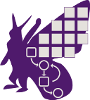
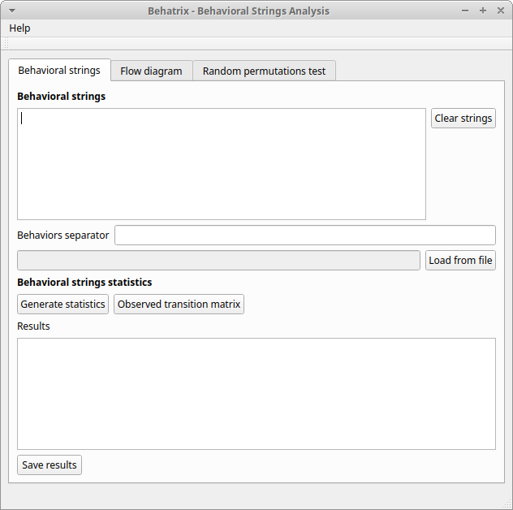
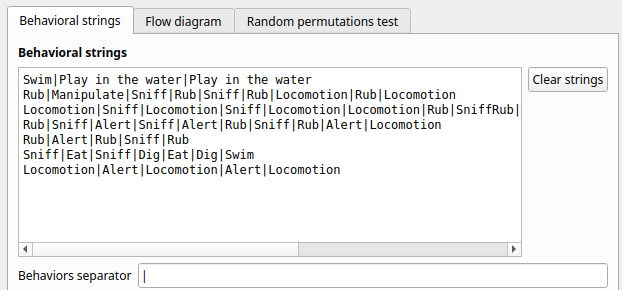
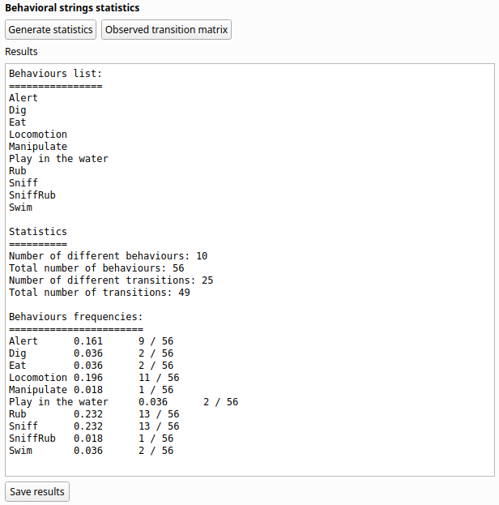
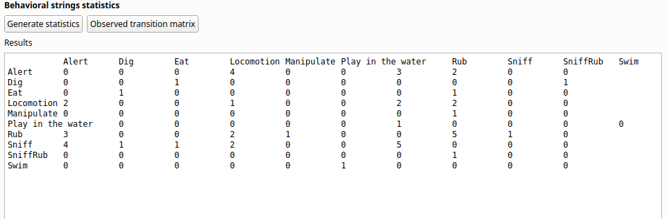
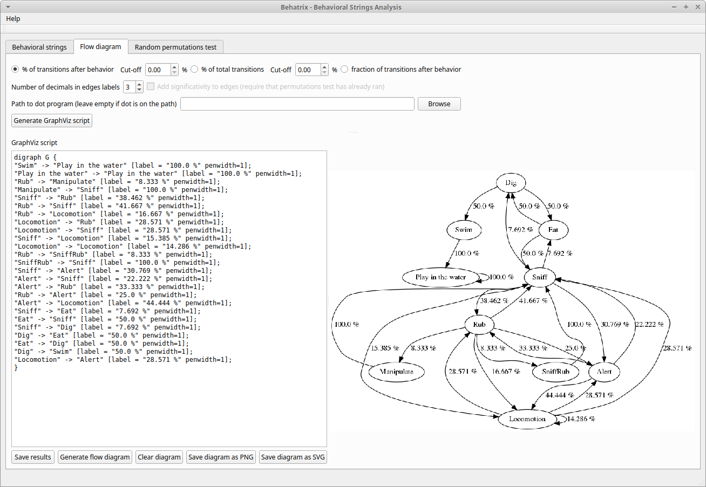
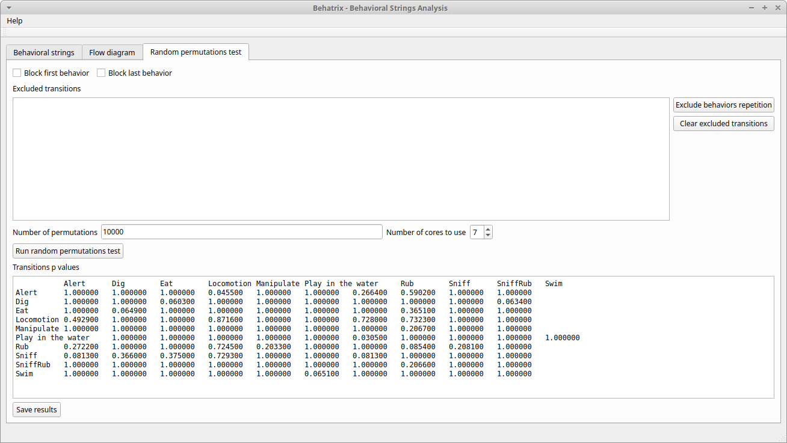
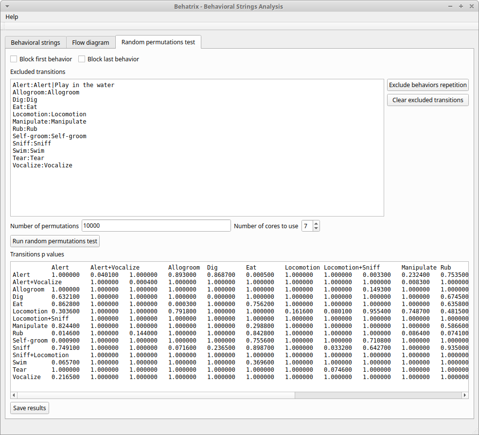

============================================================================================================================================
Behatrix
============================================================================================================================================

:Author: `Olivier Friard <http://www.di.unito.it/~friard>`_
:Author: Marco Gamba

**Behavioral sequences analysis with permutation test**

**Behatrix** was formerly named BSA (Behavioral Strings Analysis)

The details of modifications are available in the `revision history <https://github.com/olivierfriard/behatrix/wiki/revision-history>`_ .

Installation
============================================================================================================================================

Behatrix source code and executable binary programs for Linux, Mac and Microsoft-Windows are available in `latest releases <https://github.com/olivierfriard/behatrix/releases/latest>`_.

Launch of Behatrix on Microsoft Windows
============================================================================================================================================

An executable binary program is available on the `latest releases <https://github.com/olivierfriard/behatrix/releases/latest>`_

Launch the **behatrix.exe** program

The `Graphviz package <http://www.graphviz.org>`_ is required for generating graph.
Once installed you can add the directory containing the **dot** program to the PATH environment variable.
See `Adding directory to PATH Environment Variable in Windows <https://superuser.com/questions/949560/how-do-i-set-system-environment-variables-in-windows-10>`_ for details.
If you do not add the dot program to the path you must specify the path to the dot program in Behatrix.

Alternatively to installing Graphviz you can use remote Graphviz services like:

* `Viz.js <http://viz-js.com/>`_

* `WebGraphviz <http://www.webgraphviz.com/>`_

* `GraphvizOnline <https://dreampuf.github.io/GraphvizOnline>`_

Launch of Behatrix on Mac OS
============================================================================================================================================

An DMG image containing executable binary is available on `latest release <https://github.com/olivierfriard/behatrix/releases/latest>`_

Mount the **behatrix.dmg** image and launch **behatrix** program.

The `GraphViz package <http://www.graphviz.org>`_ is required for generating graph.
See `Graphviz on Mac OS <http://www.graphviz.org/Download_macos.php>`_ for details.

Launch of Behatrix on Linux
============================================================================================================================================

An executable binary program is available on the `latest releases <https://github.com/olivierfriard/behatrix/releases/latest>`_

Extract the archive and launch the **behatrix** executable.

Launch Behatrix from sources (all platforms)
============================================================================================================================================

Requirements
--------------------------------------------------------------------------------------------------------------------------------------------

* Python3
* Numpy
* PyQt5 for the GUI version
* graphviz package (optional)

Usage of the GUI interface
============================================================================================================================================

The Behatrix main window
--------------------------------------------------------------------------------------------------------------------------------------------

The behavioral strings can be directly written, paste or loaded from file in the **Behavioral strings** edit box.

See the `BORIS <http://www.boris.unito.it/>`_ user guide for `exporting behavioral strings <https://boris.readthedocs.io/en/latest/#export-events-as-behavioral-strings>`_.

Behaviors and transitions statistics
--------------------------------------------------------------------------------------------------------------------------------------------

Matrix of observed transitions
--------------------------------------------------------------------------------------------------------------------------------------------

Flow diagram
--------------------------------------------------------------------------------------------------------------------------------------------

**Graphviz required**

Permutations test
--------------------------------------------------------------------------------------------------------------------------------------------

**Please note**: the binary version for Windows do NOT allow to run the permutations test using more than one core.
If you want to use more than one core you must run Behatrix from sources.

Permutations test with exclusions
--------------------------------------------------------------------------------------------------------------------------------------------

Some transitions can be excluded from the permutations test:

Usage of command line utility
--------------------------------------------------------------------------------------------------------------------------------------------

.. code-block:: text

    usage: behatrix_cli.py [-h] [-v] [--strings STRINGS] [--output OUTPUT]
                           [--exclusions EXCLUSIONS] [--n_random NRANDOM]
                           [--n_cpu N_CPU] [--block_first] [--block_last]
                           [--quiet]

    Behatrix command line utility

    optional arguments:
      -h, --help            show this help message and exit
      -v                    Behatrix version
      --strings STRINGS     Path of file containing behavioral strings
      --output OUTPUT       Path of output files
      --exclusions EXCLUSIONS
                            Path of file containing exclusions
      --n_random NRANDOM    Number of randomizations
      --n_cpu N_CPU         Number of CPU to use for randomizations test
      --block_first         block first behavior during randomization test
      --block_last          block last behavior during randomization test
      --quiet               Do not print results on terminal

Example of use
....................

.. code-block:: text

  python3 behatrix_cli.py --strings behav_strings.txt --output behav_strings_results --n_cpu 6 --n_random 10000

Example of behavioral strings file
........................................

Behaviors are separated by the pipe character (|) otherwise each character will be interpreted as a behavior

.. code-block:: text

  Swim|Play in the water|Play in the water
  Swim|Play in the water|Swim|Swim|Play in the water|Swim|Play in the water|Play in the water|Alert|Locomotion|Swim
  Locomotion|Locomotion|Alert|Sniff|Rub|Locomotion
  Locomotion|Alert|Alert+Vocalize|Alert+Vocalize|Locomotion
  Locomotion|Alert|Sniff|Rub|Rest|Locomotion|Locomotion|Locomotion|Locomotion+Sniff|Sniff|Alert|Drink|Alert
  Sniff|Manipulate|Locomotion|Locomotion|Locomotion|Locomotion|Rub|Alert|Sniff|Alert|Manipulate|Locomotion
  Manipulate
  Play on the ground|Manipulate|Locomotion
  Rub|Locomotion|Sniff|Alert|Rub|Locomotion|Rub|Locomotion|Rub|Alert|Locomotion|Rub|Sniff|Rub|Sniff|Dig|Rest|Rub|Locomotion|Rub
  Rub|Manipulate|Sniff|Rub|Sniff|Rub|Locomotion|Rub|Locomotion
  Play on the ground|Locomotion
  Locomotion|Manipulate|Alert|Sniff|Sniff+Locomotion|Sniff|Manipulate|Sniff
  Self-groom|Sniff|Locomotion|Locomotion+Sniff|Sniff|Defecate|Defecate+Urinate|Defecate+Urinate+Yawn|Urinate|Locomotion|Locomotion+Sniff|Sniff
  Sniff|Sniff|Defecate|Defecate+Urinate|Defecate+Urinate+Stomp|Defecate+Urinate|Defecate+Urinate+Yawn|Urinate|Locomotion|Dig|Locomotion
  Play on the ground
  Locomotion|Sniff|Locomotion|Locomotion+Sniff|Sniff|Locomotion|Locomotion|Rub|Sniff
  Rub|Sniff|Rub|Locomotion
  Alert|Alert+Vocalize|Alert+Vocalize|Rub|Rub+Vocalize|Rub+Vocalize|Vocalize|Alert|Alert+Vocalize|Alert+Vocalize|Alert+Vocalize|Rub|Alert|Rub|Alert|Self-groom|Alert|Rub|Locomotion|Locomotion
  Locomotion|Alert|Locomotion|Alert|Locomotion|Locomotion|Locomotion|Locomotion+Sniff|Locomotion|Alert|Locomotion|Rub|Alert|Rub|Alert|Rub|Alert|Rub|Allogroom|Rub|Alert|Rub|Alert|Rub|Alert|Locomotion
  Alert|Alert+Vocalize|Alert+Vocalize|Alert+Vocalize|Rub|Self-groom|Alert|Alert+Vocalize|Rub|Locomotion|Alert|Locomotion|Alert|Locomotion
  Sniff|Alert|Locomotion
  Locomotion|Alert|Rub|Self-groom|Alert|Self-groom|Rub|Self-groom|Alert|Rub|Alert|Rub
  Rub|Sniff|Alert|Sniff|Alert|Rub|Sniff|Rub|Alert|Locomotion
  Rub|Alert|Rub|Sniff|Rub
  Rub|Rub|Sniff
  Locomotion|Manipulate|Alert|Locomotion|Manipulate|Tear|Manipulate|Tear
  Self-groom|Locomotion|Self-groom|Alert|Self-groom|Alert|Locomotion
  Alert|Locomotion|Locomotion+Sniff|Sniff|Manipulate|Locomotion|Locomotion+Sniff|Sniff|Manipulate|Sniff|Sniff+Locomotion|Sniff|Manipulate|Locomotion|Manipulate
  Locomotion|Alert|Locomotion|Alert|Locomotion
  Swim|Swim|Locomotion|Locomotion+Sniff|Locomotion|Locomotion+Sniff|Sniff|Sniff|Swim|Locomotion|Locomotion|Locomotion|Swim|Alert|Swim|Swim|Alert|Eat|Alert|Swim|Alert|Sniff|Eat|Dig|Eat|Locomotion|Dig|Eat|Swim|Alert|Sniff|Alert|Sniff|Dig|Eat|Dig|Eat|Dig|Sniff|Dig|Alert|Dig|Alert|Locomotion
  Sniff|Eat|Sniff|Dig|Eat|Dig|Swim

Legal
=====

Copyright 2017-2019 Olivier Friard

**Behatrix** is free software; you can redistribute it and/or modify
it under the terms of the GNU General Public License as published by
the Free Software Foundation; either version 2, or any later version.

**Behatrix** is distributed in the hope that it will be useful,
but WITHOUT ANY WARRANTY; without even the implied warranty of
MERCHANTABILITY or FITNESS FOR A PARTICULAR PURPOSE.  See the
`GNU General Public License <http://www.gnu.org/copyleft/gpl.html>`_ for more details.

