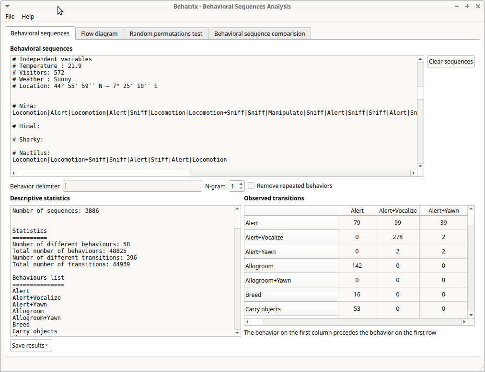
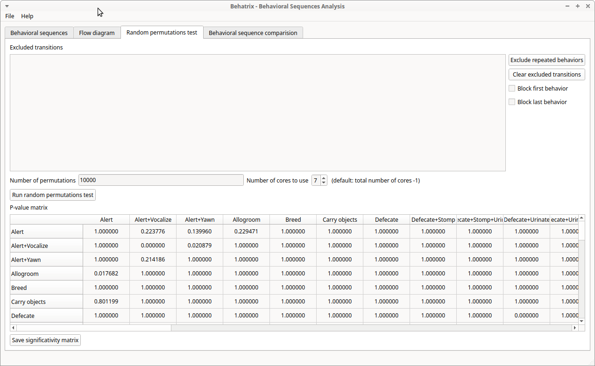

============================================================================================================================================
Behatrix
============================================================================================================================================

:Author: Olivier Friard
:Author: Marco Gamba

**Behavioral sequences analysis with random permutations test**

**Behatrix is free and open-source software available for GNU/Linux, Windows and MacOS.**

**Behatrix** was formerly named BSA (Behavioral Strings Analysis)

The details of modifications are available in the `revision history <https://github.com/olivierfriard/behatrix/wiki/revision-history>`_ .

Install Behatrix
============================================================================================================================================

**Behatrix** can be downloaded from the `GiHub repository <https://github.com/olivierfriard/behatrix/releases>`_

All versions are *portable*, they do not need to be installed on your system.

All previous versions of **Behatrix** are available in the GitHub repository.

GNU/Linux
--------------------------------------------------------------------------------------------------------------------------------------------

Download the **behatrix-x.y.z-x86_64.tar.gz** file, unzip it, go to the **bin** directory and launch the **start_behatrix**.

Microsoft-Windows
------------------------------------------------------------------------------------------------------------------------

Download the **behatrix-x.y.z-win64-portable.zip** file, unzip it and launch **start_behatrix.bat**.

Mac OS
------------------------------------------------------------------------------------------------------------------------

Download the **behatrix-x.y.z.dmg** image file, mount it and launch the **behatrix** program.

From sources (all platforms)
------------------------------------------------------------------------------------------------------------------------

You will need a working installation of Python >=3.6.

* Create a virtual environment (to isolate Behatrix from your system):

.. code-block:: bash

   python3 -m venv behatrix_venv

* Activate the virtual environment

.. code-block:: bash

   source behatrix_venv/bin/activate

The prompt should now be prefixed by **behatrix_venv**

* Install Behatrix

.. code-block:: bash

   pip install behatrix

* Launch Behatrix

.. code-block:: bash

   python3 -m behatrix

Flow diagram
========================================================================================================================

For flow diagrams generation you must install the **Graphviz** package.

Installation of the Graphviz package
------------------------------------------------------------------

Go to the `Graphviz web site <https://graphviz.org/download/>`_ and download the version corresponding to your system.

If the **dot** program is not on the path you will have to indicate the complete path to the dot program.

Usage of Behatrix
========================================================================================================================

Behavioral sequences
------------------------------------------------------------------------------------------------------------------------

The behavioral sequences can be directly written, paste or loaded from file in the **Behavioral strings** edit box.

See the `BORIS <http://www.boris.unito.it/>`_ user guide for 
`exporting behavioral strings <https://boris.readthedocs.io/en/latest/#export-events-as-behavioral-strings>`_.

In a behavioral sequence, the successive behaviors can be separated by any character or group of characters.
By default BORIS uses the pipe character (|). If no separator is used each different character of the sequence will be interpreted as a behavior.

The **Clear strings** button allows to eliminate all the sequences put in the edit box.

Eventually repeated behaviors in the sequences can be removed by clicking on the **Remove repeated behaviors** button.

Below, click on the **Generate statistics** button to obtain the statistical values and to **Transition matrix** to generate
the transition matrix related to the behavioral sequences.

Descriptive statistics
........................................................................................................................
Some statistics can be obtained for various **n-gram** by clocking on the **Generate statistics** button.

In the results box **Behatrix** will list all the behaviors present in the sequences in alphabetical order,
the total number of behaviors, the total number of transitions, the number of different transitions and
the behaviors frequencies.

Use the **Save results** button for both the statistics and the transition matrix.

Example of statistics for 1-gram:

.. code-block:: text

    Number of sequences: 3
    
    
    Statistics
    ==========
    Number of different behaviours: 7
    Total number of behaviours: 23
    Number of different transitions: 12
    Total number of transitions: 20
    
    Behaviours list:
    ================
    Alert
    Locomotion
    Manipulate
    Play in the water
    Play on the ground
    Roll objects
    Swim
    
    Behaviours frequencies:
    =======================
    Alert	0.304	7 / 23
    Locomotion	0.087	2 / 23
    Manipulate	0.174	4 / 23
    Play in the water	0.043	1 / 23
    Play on the ground	0.043	1 / 23
    Roll objects	0.261	6 / 23
    Swim	0.087	2 / 23

Example of statistics for 2-gram:

.. code-block:: text

    (...)

    Frequencies of 2-grams:
    =======================
    Alert|Locomotion	0.050	1 / 20
    Alert|Manipulate	0.050	1 / 20
    Alert|Roll objects	0.250	5 / 20
    Manipulate|Alert	0.100	2 / 20
    Manipulate|Locomotion	0.050	1 / 20
    Manipulate|Roll objects	0.050	1 / 20
    Play in the water|Swim	0.050	1 / 20
    Play on the ground|Manipulate	0.050	1 / 20
    Roll objects|Alert	0.200	4 / 20
    Roll objects|Manipulate	0.050	1 / 20
    Swim|Alert	0.050	1 / 20
    Swim|Play in the water	0.050	1 / 20

Observed transition matrix
........................................................................................................................

Example of observed transition matrix:

.. code-block:: text

                         Alert   Locomotion   Manipulate  Play in the water Play on the ground  Roll objects   Swim
   Alert                     0            1            1                  0                  0             5      0
   Locomotion                0            0            0                  0                  0             0      0
   Manipulate                2            1            0                  0                  0             1      0
   Play in the water         0            0            0                  0                  0             0      1
   Play on the ground        0            0            1                  0                  0             0      0
   Roll objects              4            0            1                  0                  0             0      0
   Swim                      1            0            0                  1                  0             0      0 

Flow diagram
------------------------------------------------------------------------------------------------------------------------

Click the **Generate GraphViz script** button to obtain the script then click the **Generate flow diagram** button to visualize the flow diagram.

.. image:: docs/screenshots/flow_diagram.png
   :alt: flow diagram

Permutations test
------------------------------------------------------------------------------------------------------------------------

From version 0.9.1 the binary version for Microsoft-Windows can use the multiprocessing module, the permutations test is
able to use many cores.

Permutations test with exclusions
........................................................................................................................
Some transitions can be excluded from the permutations test:

.. image:: docs/screenshots/permutations_test_with_exclusions.png
   :alt: Permutations test

Behavioral sequences distances
------------------------------------------------------------------------------------------------------------------------

Levenshtein distances
........................................................................................................................

to be finished...

Needleman-Wunsch identities
........................................................................................................................

to be finished...

Usage of command line utility
------------------------------------------------------------------------------------------------------------------------

.. code-block:: text

    usage:
    python3 -m behatrix [options]

    Behatrix command line utility

    optional arguments:
      -h, --help            show this help message and exit
      -v, --version         Behatrix version
      -s SEQUENCES, --sequences SEQUENCES
                            Path of file containing behavioral sequences
      --separator SEPARATOR
                            Separator of behaviors
      -o OUTPUT, --output OUTPUT
                            Path of output files
      --exclusions EXCLUSIONS
                            Path of file containing exclusions
      --n-random NRANDOM    Number of permutations
      --n-cpu N_CPU         Number of CPU to use for permutations test
      --block-first         block first behavior during permutations test
      --block-last          block last behavior during permutations test
      --no-repetition       exclude repetitions during permutations test
      --n-gram NGRAM        n-gram value
      -q, --quiet           Do not print results on terminal

    See http://www.boris.unito.it/pages/behatrix for details :-)

Example of use
....................

.. code-block:: text

    python3 -m behatrix --sequences behav_sequences.txt --output behav_sequences_results --n_cpu 6 --n_random 10000

Example of behavioral sequences file
...................................................

Behaviors are separated by the pipe character (|) otherwise each character will be interpreted as a behavior

.. code-block:: text

  Swim|Play in the water|Play in the water
  Swim|Play in the water|Swim|Swim|Play in the water|Swim|Play in the water|Play in the water|Alert|Locomotion|Swim
  Locomotion|Locomotion|Alert|Sniff|Rub|Locomotion
  Locomotion|Alert|Alert+Vocalize|Alert+Vocalize|Locomotion
  Locomotion|Alert|Sniff|Rub|Rest|Locomotion|Locomotion|Locomotion|Locomotion+Sniff|Sniff|Alert|Drink|Alert
  Sniff|Manipulate|Locomotion|Locomotion|Locomotion|Locomotion|Rub|Alert|Sniff|Alert|Manipulate|Locomotion
  Manipulate
  Play on the ground|Manipulate|Locomotion
  Rub|Locomotion|Sniff|Alert|Rub|Locomotion|Rub|Locomotion|Rub|Alert|Locomotion|Rub|Sniff|Rub|Sniff|Dig|Rest|Rub|Locomotion|Rub
  Rub|Manipulate|Sniff|Rub|Sniff|Rub|Locomotion|Rub|Locomotion
  Play on the ground|Locomotion
  Locomotion|Manipulate|Alert|Sniff|Sniff+Locomotion|Sniff|Manipulate|Sniff
  Self-groom|Sniff|Locomotion|Locomotion+Sniff|Sniff|Defecate|Defecate+Urinate|Defecate+Urinate+Yawn|Urinate|Locomotion|Locomotion+Sniff|Sniff
  Sniff|Sniff|Defecate|Defecate+Urinate|Defecate+Urinate+Stomp|Defecate+Urinate|Defecate+Urinate+Yawn|Urinate|Locomotion|Dig|Locomotion
  Play on the ground
  Locomotion|Sniff|Locomotion|Locomotion+Sniff|Sniff|Locomotion|Locomotion|Rub|Sniff
  Rub|Sniff|Rub|Locomotion
  Alert|Alert+Vocalize|Alert+Vocalize|Rub|Rub+Vocalize|Rub+Vocalize|Vocalize|Alert|Alert+Vocalize|Alert+Vocalize|Alert+Vocalize|Rub|Alert|Rub|Alert|Self-groom|Alert|Rub|Locomotion|Locomotion
  Locomotion|Alert|Locomotion|Alert|Locomotion|Locomotion|Locomotion|Locomotion+Sniff|Locomotion|Alert|Locomotion|Rub|Alert|Rub|Alert|Rub|Alert|Rub|Allogroom|Rub|Alert|Rub|Alert|Rub|Alert|Locomotion
  Alert|Alert+Vocalize|Alert+Vocalize|Alert+Vocalize|Rub|Self-groom|Alert|Alert+Vocalize|Rub|Locomotion|Alert|Locomotion|Alert|Locomotion
  Sniff|Alert|Locomotion
  Locomotion|Alert|Rub|Self-groom|Alert|Self-groom|Rub|Self-groom|Alert|Rub|Alert|Rub
  Rub|Sniff|Alert|Sniff|Alert|Rub|Sniff|Rub|Alert|Locomotion
  Rub|Alert|Rub|Sniff|Rub
  Rub|Rub|Sniff
  Locomotion|Manipulate|Alert|Locomotion|Manipulate|Tear|Manipulate|Tear
  Self-groom|Locomotion|Self-groom|Alert|Self-groom|Alert|Locomotion
  Alert|Locomotion|Locomotion+Sniff|Sniff|Manipulate|Locomotion|Locomotion+Sniff|Sniff|Manipulate|Sniff|Sniff+Locomotion|Sniff|Manipulate|Locomotion|Manipulate
  Locomotion|Alert|Locomotion|Alert|Locomotion
  Swim|Swim|Locomotion|Locomotion+Sniff|Locomotion|Locomotion+Sniff|Sniff|Sniff|Swim|Locomotion|Locomotion|Locomotion|Swim|Alert|Swim|Swim|Alert|Eat|Alert|Swim|Alert|Sniff|Eat|Dig|Eat|Locomotion|Dig|Eat|Swim|Alert|Sniff|Alert|Sniff|Dig|Eat|Dig|Eat|Dig|Sniff|Dig|Alert|Dig|Alert|Locomotion
  Sniff|Eat|Sniff|Dig|Eat|Dig|Swim

Legal
========================

Copyright 2017-2022 Olivier Friard

**Behatrix** is free software; you can redistribute it and/or modify
it under the terms of the GNU General Public License as published by
the Free Software Foundation; either version 2, or any later version.

**Behatrix** is distributed in the hope that it will be useful,
but WITHOUT ANY WARRANTY; without even the implied warranty of
MERCHANTABILITY or FITNESS FOR A PARTICULAR PURPOSE.  See the
`GNU General Public License <http://www.gnu.org/copyleft/gpl.html>`_ for more details.

