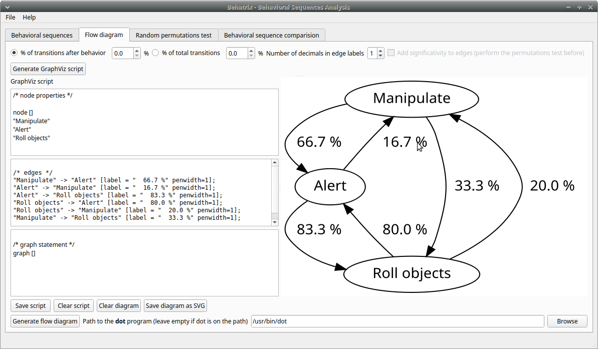
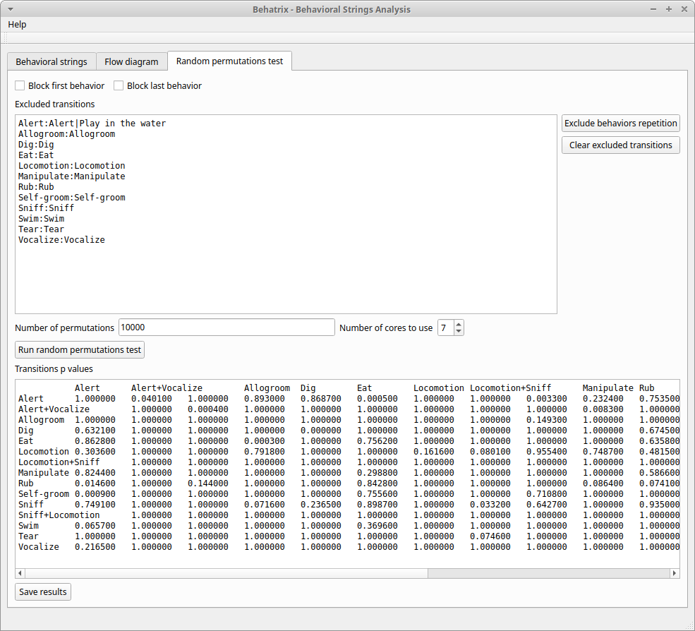

Behatrix
==================


| Authors       |
| ------------- |
| Olivier Friard and Marco Gamba |
| Department of Life Science and Systems Biology |
| University of Torino, Italy |


**Behavioral sequences analysis with random permutations test**


**Behatrix is free and open-source software available for GNU/Linux, Windows and MacOS.**


The details of modifications are available on the [change log](https://github.com/olivierfriard/behatrix/wiki/revision-history) page.


# Install Behatrix

**Behatrix** can be downloaded from the [GiHub repository](https://github.com/olivierfriard/behatrix/releases).

<!-- All versions are *portable*, they do not need to be installed on your system. -->

All previous versions of **Behatrix** are available in the [release GitHub repository](https://github.com/olivierfriard/behatrix/releases).


## GNU/Linux

* Download the **behatrix-x.y.z-x86_64.tar.gz** file, unzip it, go to the **bin** directory and launch the **start_behatrix**.

or

* See the [From sources section](#From-sources)


## Microsoft-Windows

* Download the **behatrix-x.y.z-win64-setup.exe** file, unzip it and launch **start_behatrix.bat**.

or

* See the [From sources section](#From-sources)

 
 ## Mac OS

See the [From sources section](#From-sources)


## From sources

This method should work with Linux, Windows and MacOS.

### New method with [uv](https://docs.astral.sh/uv/), "an extremely fast Python package and project manager"

* [Install the **uv** package manager](https://docs.astral.sh/uv/#getting-started)


* Install and run Behatrix:


``` {.bash}
uvx behatrix
```


### Classic method with pip, the package management system for Python

You will need a working installation of Python >=3.8 and <=3.12.
All the commands cited below must be executed in a [terminal](#How-to-open-a-terminal).

* Create a virtual environment (to isolate Behatrix from your system):


``` {.bash}
python3 -m venv behatrix_venv
```


* Activate the virtual environment

``` {.bash}
source behatrix_venv/bin/activate
```

The prompt should now be prefixed by **behatrix_venv**


* Install Behatrix

``` {.bash}
pip install behatrix
```


* Launch Behatrix

``` {.bash}
python3 -m behatrix
```

For future uses:

``` {.bash}
source behatrix_venv/bin/activate
python3 -m behatrix
```


# Flow diagram


For flow diagrams generation you must install the **Graphviz** package.


## Installation of the Graphviz package


Go to the [Graphviz web site](https://graphviz.org/download), download and install the version corresponding to your system.

If the **dot** program is not on the path you will have to indicate the complete path to the dot program.


# Usage of Behatrix


## Behavioral sequences


The behavioral sequences can be directly written, paste or loaded from file in the **Behavioral sequences** edit box.

See the [BORIS user guide](http://www.boris.unito.it/user_guide)
for [exporting behavioral sequences](https://www.boris.unito.it/user_guide/export_events/#export-events-as-behavioral-sequences).


In a behavioral sequence, the successive behaviors can be separated by any character or group of characters.
By default BORIS uses the pipe character (|). If no separator is used each different character of the sequence will be interpreted as a behavior.

The **Clear strings** button allows to eliminate all the sequences put in the edit box.

Eventually repeated behaviors in the sequences can be removed by clicking on the **Remove repeated behaviors** button.

Below, click on the **Generate statistics** button to obtain the statistical values and to **Transition matrix** to generate
the transition matrix related to the behavioral sequences.


## Descriptive statistics

Some statistics can be obtained for various **n-gram**.

In the results box **Behatrix** will list all the behaviors present in the sequences in alphabetical order,
the total number of behaviors, the total number of transitions, the number of different transitions and
the behaviors frequencies.

Use the **Save results** button for both the statistics and the transition matrix.


Example of statistics for 1-gram:

``` {.text}
Number of sequences: 3886


Statistics
==========
Number of different behaviours: 58
Total number of behaviours: 48825
Number of different transitions: 396
Total number of transitions: 44939

Behaviours list
===============
Alert
Alert+Vocalize
Alert+Yawn
Allogroom
Allogroom+Yawn
Breed
Carry objects
Chase
Defecate
Defecate+Stomp
Defecate+Stomp+Urinate
Defecate+Stomp+Urinate+Yawn
Defecate+Urinate
[...]
Swim
Tear
Urinate
Urinate+Defecate+Yawn
Urinate+Stomp+Defecate+Yawn
Urinate+Stomp+Yawn
Urinate+Yawn
Vocalize
Vomit
Yawn

Behaviours frequencies
==============================
Alert	0.205	10012 / 48825
Alert+Vocalize	0.008	379 / 48825
Alert+Yawn	0.001	43 / 48825
Allogroom	0.005	266 / 48825
Allogroom+Yawn	0.000	1 / 48825
Breed	0.001	54 / 48825
Carry objects	0.009	440 / 48825
Chase	0.000	13 / 48825
Defecate	0.004	215 / 48825
Defecate+Stomp	0.002	95 / 48825
Defecate+Stomp+Urinate	0.003	163 / 48825
Defecate+Stomp+Urinate+Yawn	0.001	48 / 48825
[...]
Swim	0.016	763 / 48825
Tear	0.002	116 / 48825
Urinate	0.011	525 / 48825
Urinate+Defecate+Yawn	0.000	9 / 48825
Urinate+Stomp+Defecate+Yawn	0.000	1 / 48825
Urinate+Stomp+Yawn	0.000	2 / 48825
Urinate+Yawn	0.000	4 / 48825
Vocalize	0.000	5 / 48825
Vomit	0.000	2 / 48825
Yawn	0.000	1 / 48825

```


Example of statistics for 2-gram:

``` {.text}

Number of sequences: 3886


2-grams
====================
Number of different 2-grams: 396
Total number of 2-grams: 44939
Number of different transitions: 2572
Total number of transitions: 7284


Frequencies
==============================
Tear|Locomotion	0.001	34 / 44939
Tear|Carry objects	0.001	25 / 44939
Manipulate|Locomotion	0.019	835 / 44939
Alert|Rest	0.012	529 / 44939
Locomotion|Locomotion	0.020	903 / 44939
Locomotion|Alert	0.037	1648 / 44939
Alert|Locomotion	0.075	3381 / 44939
Locomotion|Allogroom	0.000	9 / 44939
Allogroom|Locomotion	0.001	26 / 44939
Locomotion|Drink	0.000	17 / 44939
Drink|Swim	0.000	5 / 44939
Locomotion|Rest	0.003	121 / 44939
Rest|Locomotion	0.003	145 / 44939
```


## Observed transition matrix


Example of observed transition matrix:

``` {.text}

                         Alert   Locomotion   Manipulate  Play in the water Play on the ground  Roll objects   Swim
   Alert                     0            1            1                  0                  0             5      0
   Locomotion                0            0            0                  0                  0             0      0
   Manipulate                2            1            0                  0                  0             1      0
   Play in the water         0            0            0                  0                  0             0      1
   Play on the ground        0            0            1                  0                  0             0      0
   Roll objects              4            0            1                  0                  0             0      0
   Swim                      1            0            0                  1                  0             0      0 
```


## Flow diagram


Click the **Generate GraphViz script** button to obtain the script then click the **Generate flow diagram** button to visualize the flow diagram.




## Permutations test


## Permutations test with exclusions

Some transitions can be excluded from the permutations test:




## Behavioral sequences distances


### Levenshtein distances


to be finished...


### Needleman-Wunsch identities


to be finished...


# Usage of command line utility


``` {.text}
   usage:
   python3 -m behatrix [options]

   Behatrix command line utility

   optional arguments:
   -h, --help            show this help message and exit
   -v, --version         Behatrix version
   -s SEQUENCES, --sequences SEQUENCES
                           Path of file containing behavioral sequences
   --separator SEPARATOR
                           Separator of behaviors
   -o OUTPUT, --output OUTPUT
                           Path of output files
   --exclusions EXCLUSIONS
                           Path of file containing exclusions
   --n-random NRANDOM    Number of permutations
   --n-cpu N_CPU         Number of CPU to use for permutations test
   --block-first         block first behavior during permutations test
   --block-last          block last behavior during permutations test
   --no-repetition       exclude repetitions during permutations test
   --n-gram NGRAM        n-gram value
   -q, --quiet           Do not print results on terminal

   See http://www.boris.unito.it/behatrix for details :-)
```


## Example of use


``` {.bash}
    python3 -m behatrix --sequences behav_sequences.txt --output behav_sequences_results --n_cpu 6 --n_random 10000
 ```


Example of behavioral sequences file
...................................................

Behaviors are separated by the pipe character (|) otherwise each character will be interpreted as a behavior

``` {.bash}

  Swim|Play in the water|Play in the water
  Swim|Play in the water|Swim|Swim|Play in the water|Swim|Play in the water|Play in the water|Alert|Locomotion|Swim
  Locomotion|Locomotion|Alert|Sniff|Rub|Locomotion
  Locomotion|Alert|Alert+Vocalize|Alert+Vocalize|Locomotion
  Locomotion|Alert|Sniff|Rub|Rest|Locomotion|Locomotion|Locomotion|Locomotion+Sniff|Sniff|Alert|Drink|Alert
  Sniff|Manipulate|Locomotion|Locomotion|Locomotion|Locomotion|Rub|Alert|Sniff|Alert|Manipulate|Locomotion
  Manipulate
  Play on the ground|Manipulate|Locomotion
  Rub|Locomotion|Sniff|Alert|Rub|Locomotion|Rub|Locomotion|Rub|Alert|Locomotion|Rub|Sniff|Rub|Sniff|Dig|Rest|Rub|Locomotion|Rub
  Rub|Manipulate|Sniff|Rub|Sniff|Rub|Locomotion|Rub|Locomotion
  Play on the ground|Locomotion
  Locomotion|Manipulate|Alert|Sniff|Sniff+Locomotion|Sniff|Manipulate|Sniff
  Self-groom|Sniff|Locomotion|Locomotion+Sniff|Sniff|Defecate|Defecate+Urinate|Defecate+Urinate+Yawn|Urinate|Locomotion|Locomotion+Sniff|Sniff
  Sniff|Sniff|Defecate|Defecate+Urinate|Defecate+Urinate+Stomp|Defecate+Urinate|Defecate+Urinate+Yawn|Urinate|Locomotion|Dig|Locomotion
  Play on the ground
  Locomotion|Sniff|Locomotion|Locomotion+Sniff|Sniff|Locomotion|Locomotion|Rub|Sniff
  Rub|Sniff|Rub|Locomotion
  Alert|Alert+Vocalize|Alert+Vocalize|Rub|Rub+Vocalize|Rub+Vocalize|Vocalize|Alert|Alert+Vocalize|Alert+Vocalize|Alert+Vocalize|Rub|Alert|Rub|Alert|Self-groom|Alert|Rub|Locomotion|Locomotion
  Locomotion|Alert|Locomotion|Alert|Locomotion|Locomotion|Locomotion|Locomotion+Sniff|Locomotion|Alert|Locomotion|Rub|Alert|Rub|Alert|Rub|Alert|Rub|Allogroom|Rub|Alert|Rub|Alert|Rub|Alert|Locomotion
  Alert|Alert+Vocalize|Alert+Vocalize|Alert+Vocalize|Rub|Self-groom|Alert|Alert+Vocalize|Rub|Locomotion|Alert|Locomotion|Alert|Locomotion
  Sniff|Alert|Locomotion
  Locomotion|Alert|Rub|Self-groom|Alert|Self-groom|Rub|Self-groom|Alert|Rub|Alert|Rub
  Rub|Sniff|Alert|Sniff|Alert|Rub|Sniff|Rub|Alert|Locomotion
  Rub|Alert|Rub|Sniff|Rub
  Rub|Rub|Sniff
  Locomotion|Manipulate|Alert|Locomotion|Manipulate|Tear|Manipulate|Tear
  Self-groom|Locomotion|Self-groom|Alert|Self-groom|Alert|Locomotion
  Alert|Locomotion|Locomotion+Sniff|Sniff|Manipulate|Locomotion|Locomotion+Sniff|Sniff|Manipulate|Sniff|Sniff+Locomotion|Sniff|Manipulate|Locomotion|Manipulate
  Locomotion|Alert|Locomotion|Alert|Locomotion
  Swim|Swim|Locomotion|Locomotion+Sniff|Locomotion|Locomotion+Sniff|Sniff|Sniff|Swim|Locomotion|Locomotion|Locomotion|Swim|Alert|Swim|Swim|Alert|Eat|Alert|Swim|Alert|Sniff|Eat|Dig|Eat|Locomotion|Dig|Eat|Swim|Alert|Sniff|Alert|Sniff|Dig|Eat|Dig|Eat|Dig|Sniff|Dig|Alert|Dig|Alert|Locomotion
  Sniff|Eat|Sniff|Dig|Eat|Dig|Swim
```

# How to open a terminal

## Linux


* Press `CTRL` + `ALT` + `T` simultaneously to open the terminal.

* Or open Show Application in the Dash Bar & find out **Terminal** Application.

* Or execute the command gnome-terminal in the command dialogue opened using `ALT` + `F2`


## Windows

* Click the Search or Cortana button

* Type **cmd**, **Command Prompt** or **PowerShell**

* Click the Command prompt


## MacOS

See [How to Open the Terminal on a Mac](https://www.howtogeek.com/682770/how-to-open-the-terminal-on-a-mac/)


# Legal

Copyright 2017-2024 Olivier Friard

**Behatrix** is free software; you can redistribute it and/or modify
it under the terms of the GNU General Public License as published by
the Free Software Foundation; either version 2, or any later version.

**Behatrix** is distributed in the hope that it will be useful,
but WITHOUT ANY WARRANTY; without even the implied warranty of
MERCHANTABILITY or FITNESS FOR A PARTICULAR PURPOSE.  See the
[GNU General Public License](http://www.gnu.org/copyleft/gpl.html) for more details.


